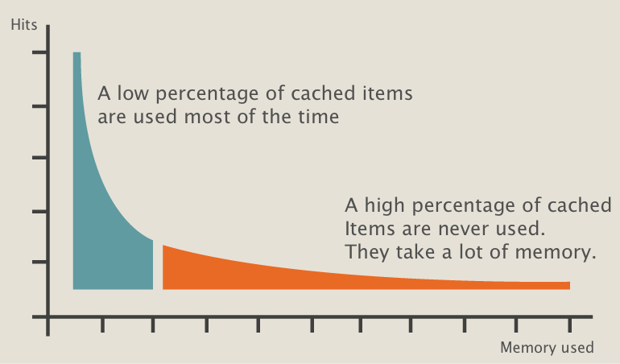

# redis-expire-least-used

When Redis is used to cache large amounts of items, **the least frequently used items can take most of the memory**.

This **proof of concept** written in LUA allows to set 2 expiration dates for each item:

 - A normal expiration date after which the item expires (traditional Redis expiration)
 - A pre-expiration date after which the item expires if it has never been accessed.

This will address the situation where the long tail takes most of the memory:



## Basic example

A search engine uses Redis to cache query results. Each search can be cached with a normal expiration of 600 seconds and a pre-expiration of 60 seconds.

We have 2 searches: `air shuttle` and `eat ice cream in an air shuttle`.

`air shuttle` will be searched more than once every 60 seconds and it will expire at its normal expiration (600 seconds).

`eat ice cream in an air shuttle` is an uncommon search query and will not be searched again within the first 60 seconds. It will expire early.

## Usage sample

### SET

Set an item.

#### Usage

`set key value expiration pre_expiration`

#### Sample

`redis-cli --eval redis_elu.lua null null , set mykey myvalue 600 60`

#### Return

Output is similar to [SET](https://redis.io/commands/set)

### GET

Get an item.

#### Usage

`get key`

#### Sample

`redis-cli --eval redis_elu.lua null null , get mykey`

#### Return

Output is similar to [GET](https://redis.io/commands/get)

### EXPIRE

Triggers expiration.

#### Usage

```
expire (limit)
```

#### Sample

```
-- expire all
redis-cli --eval redis_elu.lua null null , expire

-- expire 1,000 items maximum
redis-cli --eval redis_elu.lua null null , expire 1000
```

#### Return

Count of deleted items.
